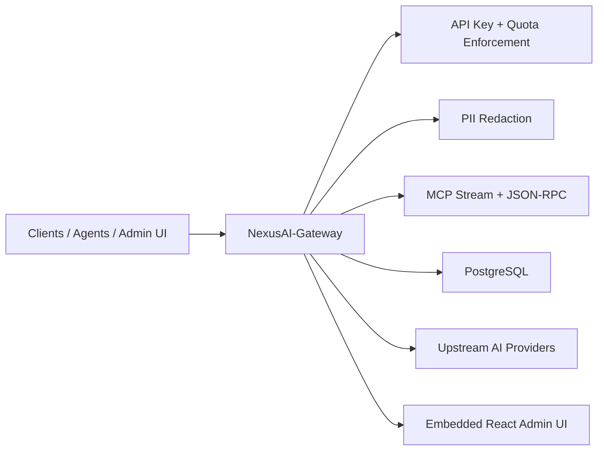

# NexusAI-Gateway

NexusAI-Gateway is the central API gateway for the NexusAI ecosystem. It provides a single ingress point for authenticated AI traffic, request routing, model catalog compatibility, streaming completions, MCP transport, and the embedded admin surface used to manage keys, usage, and provider connections.

## What It Does

- Authenticates and authorizes API access using hashed gateway keys.
- Routes OpenAI-compatible chat completion traffic to upstream providers or local fallback behavior.
- Exposes MCP stream and JSON-RPC endpoints for agent tooling.
- Tracks usage, quota, and request telemetry.
- Serves an embedded admin dashboard built with React and Vite.
- Falls back to in-memory state when persistent storage is unavailable so the service remains operable in degraded environments.

## Architecture Summary



## Tech Stack

- Go 1.22.0 for the gateway service.
- `net/http` and standard-library routing for HTTP ingress.
- PostgreSQL via `database/sql` and `github.com/lib/pq`.
- React 18, Vite, and TypeScript for the embedded dashboard.
- Docker and Docker Compose for containerized local execution.
- `golangci-lint` for Go static analysis.

## Repository Layout

```text
cmd/gateway/              Go entrypoint and server bootstrap
internal/auth/            API key parsing and hashing helpers
internal/config/          Environment configuration loading
internal/db/postgres/     PostgreSQL connection bootstrap and schema initialization
internal/domain/          Domain models, repositories, and gateway service logic
internal/gateway/         HTTP handlers, router, and MCP protocol handling
internal/privacy/         PII detection and redaction
internal/storage/         PostgreSQL and in-memory repository implementations
deployments/              Docker, Docker-Compose, Kubernetes (k8s), and Helm charts
web/                      Embedded admin dashboard source and build output
docs/                     Governance, architecture blueprints, ADRs, and runbooks
```

## Local Development

### Prerequisites

- Go 1.22.0
- Node.js 22+
- Docker and Docker Compose

### Setup

1. Run the local master bootstrap command:
   ```bash
   make bootstrap
   ```
2. Spin up database dependencies:
   ```bash
   make dev-env-up
   ```
3. Run the gateway server locally:
   ```bash
   make dev
   ```

The gateway listens on the configured `PORT` value, which defaults to `20129`.

## Environment Variables

| Variable | Purpose | Default |
| --- | --- | --- |
| `PORT` | HTTP listen port | `20129` |
| `DATABASE_URL` | PostgreSQL connection string | Local PostgreSQL fallback |
| `REDIS_URL` | Redis connection string used by the deployment profile | Local Redis fallback |
| `OIDC_ISSUER` | OIDC issuer base URL used by gateway compatibility flows | `http://localhost:20129` |
| `INITIAL_PASSWORD` | Initial admin password for bootstrap flows | Falls back to `OMNIROUTE_ADMIN_KEY` |
| `OMNIROUTE_ADMIN_KEY` | Compatibility fallback for legacy bootstrap flows | Not set |
| `UPSTREAM_API_URL` | Upstream chat completion endpoint | Not set |
| `UPSTREAM_API_KEY` | Upstream provider bearer token | Not set |

## Testing

Run the standard validation set before opening a pull request:

```bash
make test
make lint
```

## Deployment & Production Infrastructure

* Dockerfile: Production multi-stage multi-platform compilation (`deployments/Dockerfile`).
* Kubernetes: K8s resource manifests reside under `deployments/k8s/` for deployment, service, ingress, configmaps, and secret templates.
* Helm Chart: A fully-packaged Kubernetes Helm chart is available under `deployments/helm/` for automated environments.

## Comprehensive Documentation

Detailed documentation is organized under the `docs/` folder:
* **Architecture & Scalability:** See `docs/architecture/ARCHITECTURE.md` and `docs/architecture/scalability-review.md`.
* **Architecture Decision Records (ADRs):** Decisions are logged in `docs/adr/` (ADR 0001 to ADR 0004).
* **Operational Runbooks:** Operational instructions reside in `docs/runbooks/` (deployment, rollback, incident response, environment management, and local development).
* **Ecosystem Standards:** Coding guidelines reside in `docs/standards/` (branch strategy, conventional commits, pull requests, logging standard, and API standard).

## Contribution Workflow

1. Create a branch that matches the documented branch strategy in `docs/standards/branch-strategy.md`.
2. Follow conventional commits as documented in `docs/standards/conventional-commits.md`.
3. Open a pull request using `.github/PULL_REQUEST_TEMPLATE.md`.
4. Run tests and linting locally before requesting review.

See `CONTRIBUTING.md` for the full contributor workflow.
