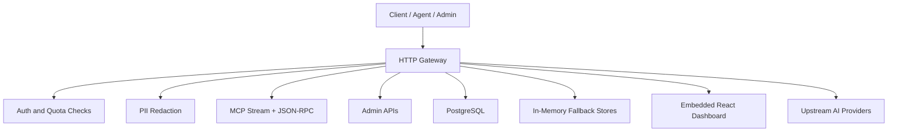

# Architecture Overview

NexusAI-Gateway is the API edge for the NexusAI ecosystem. It aggregates authentication, routing, streaming completions, MCP transport, usage tracking, and an embedded operational UI into one independently deployable service.

## High-Level Architecture

## Domain Boundaries

- `internal/auth` owns API key parsing and hashing helpers.
- `internal/config` owns environment loading and runtime defaults.
- `internal/domain` owns domain models, repository contracts, and gateway business rules.
- `internal/gateway` owns HTTP ingress, admin handlers, routing, and MCP protocol handling.
- `internal/privacy` owns prompt redaction and source-app detection helpers.
- `internal/storage` owns persistence implementations for PostgreSQL and in-memory fallback behavior.
- `web` owns the embedded dashboard source that is compiled into the Go binary.

## Main Modules

- `cmd/gateway` - server bootstrap, config loading, database connection, and graceful shutdown.
- `internal/gateway/http/router` - route registration and static asset serving.
- `internal/gateway/http/handler` - chat, model, and admin endpoints.
- `internal/gateway/mcp` - MCP SSE transport and JSON-RPC request handling.
- `internal/storage/postgres` - repository implementations backed by PostgreSQL.
- `internal/storage/memory` - degraded-mode repositories for local fallback and resilience.
- `web` - embedded React admin dashboard.

## External Integrations

- PostgreSQL for key, usage, and provider state.
- Upstream AI provider APIs for streamed completions.
- MCP-compatible agent clients that speak SSE and JSON-RPC.
- Browser clients and admin users through the embedded dashboard.

## API Flow

1. A client sends an OpenAI-compatible request to `/v1/chat/completions`.
2. The gateway authenticates the API key and checks quota limits.
3. The request body is parsed and redacted for PII.
4. The gateway proxies to the configured upstream provider or falls back to local streaming behavior.
5. Usage and latency are recorded for audit and telemetry.
6. Admin endpoints expose key management, usage, provider data, and compatibility responses for the embedded UI.

## Deployment Considerations

- The service is containerized and designed to be run behind an ingress controller or edge proxy.
- The multi-stage Docker build compiles the web UI and embeds the static output into the Go binary.
- PostgreSQL connectivity is required for full persistence, but the service can still start in a degraded in-memory mode.
- Environment variables must be supplied explicitly for non-local environments.

## Scalability Considerations

- HTTP handling is stateless, so horizontal scaling is possible when shared dependencies are available.
- PostgreSQL-backed usage accounting centralizes quota enforcement data.
- MCP streaming and SSE traffic require careful timeout and connection handling at the load balancer and ingress layers.
- Observability improvements such as request IDs, structured logs, metrics, and tracing should be added in future service-hardening work.

## Operational Notes

- The repository currently uses basic logging and should treat auth, quota, and provider configuration as security-sensitive paths.
- Fallback in-memory stores improve developer experience but should not be treated as a production persistence layer.

