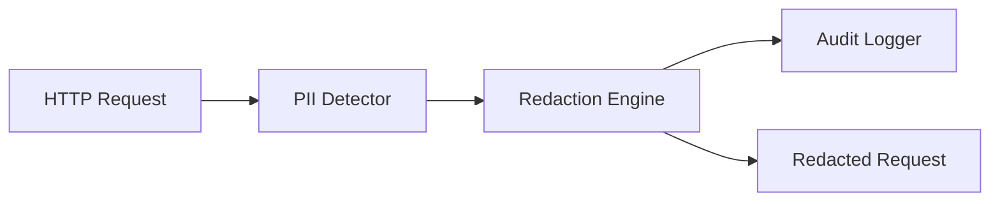

# Privacy Filter

The NexusAI Gateway includes a comprehensive Privacy Filter for detecting and redacting Personally Identifiable Information (PII) from requests before they are processed by AI models.

## Overview



## Features

- **PII Detection**: Automatic detection of multiple PII types using regex patterns and validation algorithms
- **Configurable Redaction**: Customizable redaction markers and rules per PII type
- **Audit Logging**: Comprehensive compliance logging for all redaction operations
- **HTTP Middleware**: Seamless integration with HTTP request/response pipeline
- **REST API**: Configuration endpoints for runtime management

## Supported PII Types

| Type | Pattern | Example | Validation |
|------|---------|---------|------------|
| Email | Regex | `user@example.com` | Basic format |
| Phone | Regex | `+1-555-123-4567` | Basic format |
| SSN | Regex | `123-45-6789` | Luhn + area/group/serial rules |
| Credit Card | Regex + Luhn | `4111-1111-1111-1111` | Luhn algorithm |
| IP Address | Regex | `192.168.1.1` | IPv4 format |

## Usage

### Basic Redaction

```go
import "github.com/ThomasVNN/NexusAI-Gateway/internal/privacy"

engine := privacy.NewEngine()
redacted := engine.Redact("Contact user@example.com or call 555-123-4567")
// Output: "Contact [REDACTED_EMAIL] or call [REDACTED_PHONE]"
```

### Custom Markers

```go
engine.SetMarker(privacy.PIITypeEmail, "[HIDDEN_EMAIL]")
result := engine.Redact("Email: john@example.com")
// Output: "Email: [HIDDEN_EMAIL]"
```

### Detection with Results

```go
result := engine.RedactWithResult("Email user@test.com and IP 192.168.1.1")
fmt.Printf("Total PII found: %d\n", result.TotalCount)
fmt.Printf("By type: %v\n", result.Counts)
```

### Privacy Pipeline

```go
engine := privacy.NewEngine()
logger := privacy.NewStandardAuditLogger(privacy.DefaultAuditLoggerConfig())
pipeline := privacy.NewPipeline(engine, logger)

ctx := context.Background()
redacted, err := pipeline.ProcessPrompt(
    ctx,
    "tenant-123",
    "user-456",
    "My SSN is 123-45-6789",
    privacy.PrivacyLevelMedium,
)
```

### HTTP Middleware

```go
config := &privacy.FilterMiddlewareConfig{
    Engine:        privacy.NewEngine(),
    Enabled:       true,
    IncludeBody:   true,
    IncludeQuery:  false,
    ExcludePaths:  []string{"/health", "/metrics"},
}

middleware := privacy.NewFilterMiddleware(config)
http.Handle("/api/", middleware.Middleware(apiHandler))
```

## Configuration API

### Get Configuration

```http
GET /api/privacy/config
```

Response:
```json
{
  "enabled_types": [
    {"type": "email", "marker": "[REDACTED_EMAIL]", "enabled": true},
    {"type": "phone", "marker": "[REDACTED_PHONE]", "enabled": true}
  ],
  "all_types": [...],
  "global_config": {
    "level": "standard",
    "max_redactions": 200
  },
  "stats": {
    "total_entries": 1234,
    "total_redactions": 5678
  }
}
```

### Update Type Configuration

```http
PATCH /api/privacy/types/{type}
Content-Type: application/json

{
  "enabled": true,
  "marker": "[CUSTOM_MARKER]"
}
```

### Test Redaction

```http
POST /api/privacy/test
Content-Type: application/json

{
  "text": "Contact user@example.com"
}
```

Response:
```json
{
  "original": "Contact user@example.com",
  "redacted": "Contact [REDACTED_EMAIL]",
  "counts": {"email": 1},
  "total": 1
}
```

## Privacy Levels

| Level | Description |
|-------|-------------|
| `low` | Basic redaction only |
| `medium` | Standard redaction (default) |
| `high` | Strict redaction with validation |
| `strict` | Maximum redaction with all validations |

## Redaction Levels

| Level | Description |
|-------|-------------|
| `none` | No redaction |
| `basic` | Simple pattern matching |
| `standard` | Full pattern matching |
| `strict` | Pattern matching with strict validation |

## Audit Logging

The Privacy Filter includes comprehensive audit logging for compliance:

```go
entry := &privacy.RedactionAuditEntry{
    Timestamp:     time.Now().UTC(),
    TenantID:      "tenant-123",
    UserID:        "user-456",
    RequestID:     "req-789",
    PIICounts:     map[privacy.PIIType]int{
        privacy.PIITypeEmail: 1,
        privacy.PIITypePhone: 1,
    },
    TotalRedacted: 2,
    Level:         privacy.PrivacyLevelMedium,
    Success:       true,
}
```

### Audit Recorder

For in-memory audit recording:

```go
recorder := privacy.NewAuditRecorder(logger, 24*time.Hour)
recorder.Record(entry)

// Query by tenant or user
tenantEntries := recorder.GetEntriesByTenant("tenant-123")
userEntries := recorder.GetEntriesByUser("user-456")

// Get statistics
stats := recorder.GetStats()
// stats["total_entries"], stats["total_redactions"], etc.
```

## Best Practices

1. **Enable Validation**: Always use strict validation for SSN and credit card patterns
2. **Set Redaction Caps**: Prevent DoS by limiting maximum redactions per request
3. **Audit Everything**: Log all redaction operations for compliance
4. **Exclude Health Endpoints**: Don't filter `/health`, `/metrics`, etc.
5. **Preserve Sensitive Fields**: Fields like `password` are automatically excluded

## Performance

Benchmarks (typical results on modern hardware):

- **Detection**: ~10μs per request (average text)
- **Redaction**: ~50μs per request (average text)
- **Large Text (100 PII)**: ~500μs per request

## Architecture

```
internal/privacy/
├── detector.go      # PII detection with patterns and validation
├── engine.go       # Redaction engine with configuration
├── privacy.go      # Pipeline, audit logging, interfaces
├── middleware.go   # HTTP middleware and configuration API
└── privacy_test.go # Unit tests
```

## Dependencies

- Go 1.22+
- Standard library: `regexp`, `strings`, `time`, `context`, `encoding/json`, `log/slog`

## Security Considerations

1. **No Original Storage**: Redacted content is not stored; only markers remain
2. **Audit Trail**: All operations are logged for compliance
3. **Configurable Rules**: Fine-grained control over what gets redacted
4. **Exclusion Lists**: Health/metrics endpoints are automatically excluded
